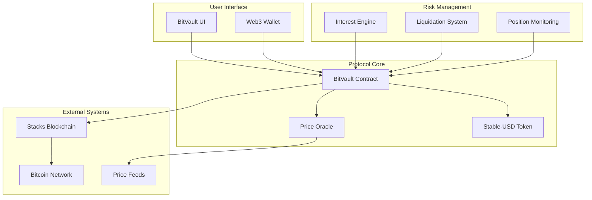
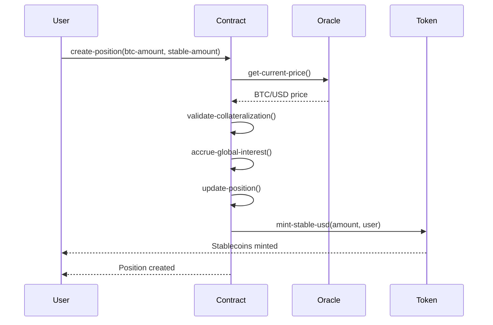
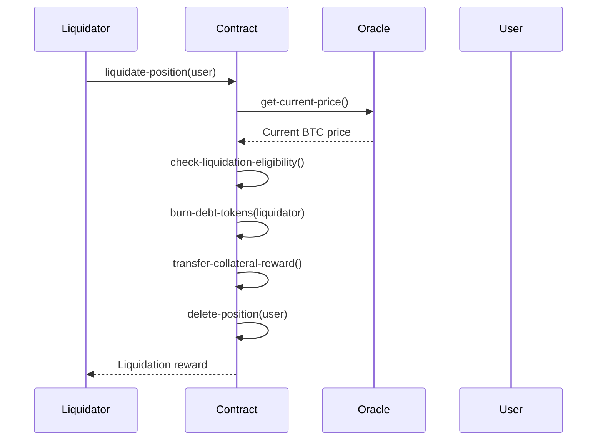

# BitVault Pro - Advanced Bitcoin Collateralization Protocol

[](https://opensource.org/licenses/MIT)
[](https://stacks.co)
[](https://clarity-lang.org)

## Overview

BitVault Pro is an enterprise-grade Bitcoin-backed stablecoin protocol that revolutionizes Bitcoin utility by enabling users to unlock liquidity from their BTC holdings without selling. Built on Stacks Layer 2, it provides seamless Bitcoin DeFi experiences with institutional-grade risk management and capital efficiency.

### Key Features

- **Bitcoin Collateralization**: Deposit Bitcoin as collateral to mint dollar-pegged stablecoins
- **Intelligent Risk Assessment**: Dynamic collateral ratios with real-time price feeds
- **Automated Liquidation**: Multi-tier liquidation protection with sophisticated mechanisms
- **Compound Interest**: Advanced interest calculations with per-block accrual
- **Governance Integration**: Protocol optimization through decentralized governance
- **Institutional Grade**: Enterprise-level security and scalability

## System Overview



## Contract Architecture

### Core Components

#### 1. **Position Management**

- **Collateralized Debt Positions (CDPs)**: User positions with BTC collateral and stablecoin debt
- **Dynamic Collateral Ratios**: Minimum 150% collateralization requirement
- **Position Safety Validation**: Real-time safety checks for all operations

#### 2. **Interest Accrual System**

- **Global Interest Tracking**: System-wide interest calculations
- **Per-Position Interest**: Individual position interest accrual
- **Compound Interest**: ~10% APR with per-block calculations

#### 3. **Price Oracle Integration**

- **Real-time Price Feeds**: BTC/USD price data with expiry validation
- **Price Staleness Protection**: 24-hour price feed validity
- **Oracle Security**: Owner-controlled price updates

#### 4. **Liquidation Engine**

- **Automated Liquidation**: Positions below 120% collateral ratio
- **Liquidation Incentives**: 10% penalty distributed to liquidators
- **Protocol Revenue**: Liquidation penalties contribute to stability fees

### Data Structures

```clarity
;; User Position
{
  collateral: uint,        ;; BTC amount in satoshis
  debt: uint,             ;; Stablecoin debt amount
  last-update-block: uint ;; Last interest accrual block
}

;; Price Data
{
  price: uint,      ;; BTC price in USD
  timestamp: uint   ;; Price timestamp
}
```

## Data Flow

### Position Creation Flow



### Liquidation Flow



## Protocol Parameters

| Parameter | Value | Description |
|-----------|-------|-------------|
| **Collateral Ratio** | 150% | Minimum collateralization requirement |
| **Liquidation Threshold** | 120% | Position liquidation trigger |
| **Liquidation Penalty** | 10% | Penalty for liquidated positions |
| **Minimum Loan** | 100 USD | Minimum stablecoin mint amount |
| **Interest Rate** | ~10% APR | Annual percentage rate |
| **Price Expiry** | 24 hours | Oracle price validity period |

## Core Functions

### User Operations

#### `create-position`

```clarity
(define-public (create-position (btc-amount uint) (stable-amount uint)))
```

Creates a new collateralized debt position or expands an existing one.

#### `add-collateral`

```clarity
(define-public (add-collateral (btc-amount uint)))
```

Adds additional BTC collateral to improve position safety.

#### `repay-debt`

```clarity
(define-public (repay-debt (amount uint)))
```

Repays stablecoin debt, potentially closing the position entirely.

#### `withdraw-collateral`

```clarity
(define-public (withdraw-collateral (btc-amount uint)))
```

Withdraws BTC collateral while maintaining minimum collateralization.

### Administrative Functions

#### `update-btc-price`

```clarity
(define-public (update-btc-price (price uint) (timestamp uint)))
```

Updates the BTC/USD price feed (owner only).

#### `pause-protocol`

```clarity
(define-public (pause-protocol (paused bool)))
```

Emergency protocol pause mechanism (owner only).

### Query Functions

#### `get-position`

```clarity
(define-read-only (get-position (user principal)))
```

Retrieves user's current position details.

#### `get-collateralization-ratio`

```clarity
(define-read-only (get-collateralization-ratio (user principal)))
```

Calculates current collateralization ratio for a position.

#### `get-protocol-stats`

```clarity
(define-read-only (get-protocol-stats))
```

Returns comprehensive protocol metrics and status.

## Error Codes

| Code | Constant | Description |
|------|----------|-------------|
| u1000 | `ERR-NOT-AUTHORIZED` | Unauthorized operation |
| u1001 | `ERR-INSUFFICIENT-COLLATERAL` | Insufficient collateral for operation |
| u1002 | `ERR-POSITION-NOT-FOUND` | User position does not exist |
| u1003 | `ERR-UNDERCOLLATERALIZED` | Position below minimum ratio |
| u1004 | `ERR-MINIMUM-LOAN-REQUIRED` | Below minimum loan amount |
| u1005 | `ERR-INSUFFICIENT-DEBT` | Insufficient debt for operation |
| u1006 | `ERR-PRICE-EXPIRED` | Oracle price data expired |
| u1007 | `ERR-PROTOCOL-PAUSED` | Protocol operations paused |
| u1008 | `ERR-INVALID-AMOUNT` | Invalid amount parameter |
| u1009 | `ERR-NO-PRICE-DATA` | No price data available |

## Security Considerations

### Risk Management

- **Collateral Requirements**: 150% minimum ratio provides buffer against price volatility
- **Liquidation Protection**: 120% threshold with 10% penalty incentivizes early liquidation
- **Interest Accrual**: Per-block calculation ensures accurate debt tracking

### Oracle Security

- **Price Staleness**: 24-hour expiry prevents stale price exploitation
- **Owner Controls**: Centralized price updates (consider decentralized oracles for production)
- **Price Validation**: Non-zero price requirements

### Protocol Controls

- **Emergency Pause**: Owner can halt operations during emergencies
- **Ownership Transfer**: Secure ownership management
- **Parameter Immutability**: Core parameters are constants (consider governance for upgrades)

## Development Setup

### Prerequisites

- [Clarinet](https://github.com/hirosystems/clarinet) - Stacks smart contract development tool
- [Node.js](https://nodejs.org/) - For running tests
- [Git](https://git-scm.com/) - Version control

### Installation

1. **Clone the repository**

   ```bash
   git clone https://github.com/manjeet-sha/bitvault.git
   cd bitvault
   ```

2. **Install dependencies**

   ```bash
   npm install
   ```

3. **Run contract checks**

   ```bash
   clarinet check
   ```

4. **Run tests**

   ```bash
   npm test
   ```

### Project Structure

```
bitvault/
├── contracts/
│   └── bitvault.clar          # Main protocol contract
├── tests/
│   └── bitvault.test.ts       # Comprehensive test suite
├── settings/
│   ├── Devnet.toml           # Development network settings
│   ├── Testnet.toml          # Testnet configuration
│   └── Mainnet.toml          # Mainnet configuration
├── Clarinet.toml             # Clarinet project configuration
├── package.json              # Node.js dependencies
├── tsconfig.json            # TypeScript configuration
└── vitest.config.js         # Test configuration
```

## Testing

The protocol includes comprehensive tests covering:

- Position creation and management
- Interest accrual calculations
- Liquidation scenarios
- Edge cases and error conditions
- Protocol administration

Run the test suite:

```bash
npm test
```

## Deployment

### Testnet Deployment

```bash
clarinet deployments generate --testnet
clarinet deployments apply --testnet
```

### Mainnet Deployment

```bash
clarinet deployments generate --mainnet
clarinet deployments apply --mainnet
```

## Roadmap

### Phase 1: Core Protocol ✅

- [x] Basic CDP functionality
- [x] Interest accrual system
- [x] Liquidation mechanism
- [x] Price oracle integration

### Phase 2: Enhanced Features

- [ ] Governance token integration
- [ ] Multi-collateral support
- [ ] Advanced liquidation strategies
- [ ] Yield farming mechanisms

### Phase 3: Ecosystem Integration

- [ ] DEX integrations
- [ ] Cross-chain bridges
- [ ] Institutional APIs
- [ ] Mobile applications

## Contributing

We welcome contributions to BitVault Pro! Please read our [Contributing Guidelines](CONTRIBUTING.md) before submitting pull requests.

### Development Process

1. Fork the repository
2. Create a feature branch
3. Write tests for new functionality
4. Ensure all tests pass
5. Submit a pull request

## License

This project is licensed under the MIT License - see the [LICENSE](LICENSE) file for details.
